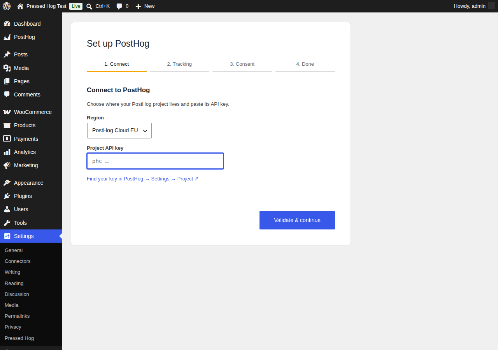
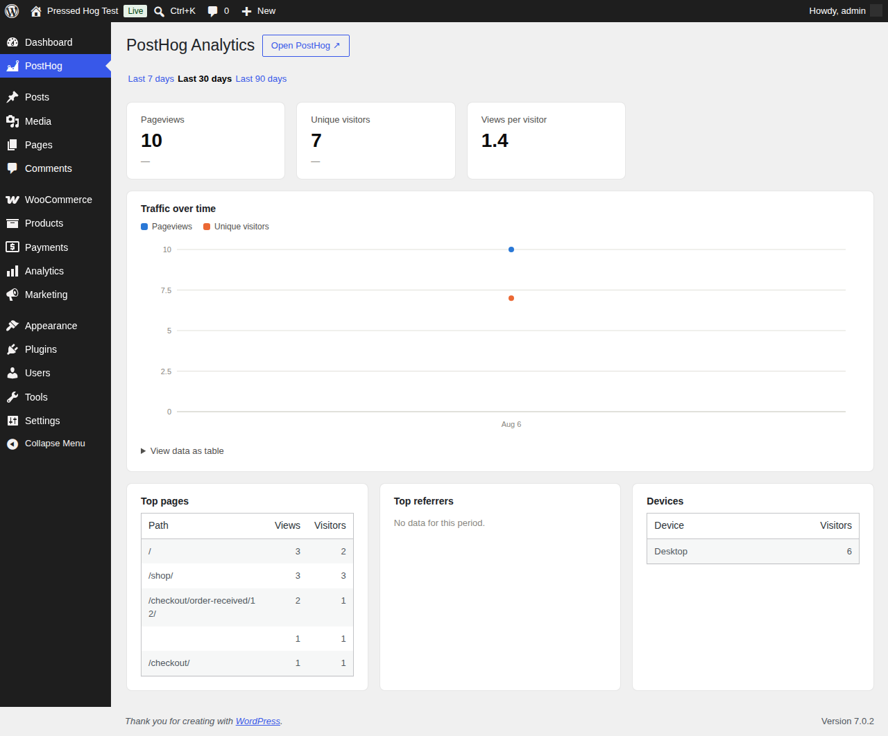

# Pressed Hog – PostHog Analytics for WordPress

A WordPress plugin that installs [PostHog](https://posthog.com) product analytics on your site: tracking snippet, session replay, surveys, user identification, WooCommerce events, feature flags, cookie consent, an ad-blocker-resistant reverse proxy, and analytics inside wp-admin. Works with PostHog Cloud (US/EU) and self-hosted instances.

**New here? Start with the [step-by-step walkthrough](docs/WALKTHROUGH.md)** — it covers installation through your first events with screenshots.



## Features

- **Guided setup wizard** — activation redirects to a 4-step wizard: pick your region (US/EU/self-hosted), paste your project API key (validated live against your PostHog host from the server), choose tracking and consent options, then send a test event to confirm end-to-end delivery. Re-run it any time from the Plugins screen.
- **Tracking toggles** — pageview capture, autocapture, session replay, and popover surveys are each switchable.
- **Identify logged-in users** — optionally call `posthog.identify()` with the WordPress user ID, email, and display name, so PostHog persons map to real accounts.
- **Role exclusions** — logged-in users with excluded roles (administrators and editors by default) never get the snippet.
- **Consent modes**
  - *None* — track immediately.
  - *Built-in banner* — a lightweight accept/decline cookie banner; PostHog starts opted-out and only captures after acceptance.
  - *External* — integrate any consent plugin: tracking starts when a configurable cookie matches, or when your plugin calls `window.pressedHog.grantConsent()` / `window.pressedHog.denyConsent()`.
- **WooCommerce events** — `product_added_to_cart` (classic and block themes), `checkout_started`, and `order_completed` (with totals and line items, deduplicated per order and gated on the order key).
- **Reverse proxy** — optionally serve PostHog through your own domain (`yoursite.com/phog/…`, prefix configurable). A rewrite rule relays requests server-side to your PostHog host, forwarding the visitor's IP via `X-Forwarded-For`. Ad-blockers that block PostHog's domains can't block first-party requests. Requires pretty permalinks.
- **In-dashboard analytics** — a "PostHog" admin page with pageviews, unique visitors, deltas vs the previous period, a traffic chart, top pages, referrers, and devices over 7/30/90 days, queried server-side from PostHog's Query API with 5-minute caching. Includes a WP dashboard widget and an optional embedded PostHog shared dashboard.
- **Feature flags, server-side** — gate content with a shortcode or PHP helpers, evaluated against PostHog's `/decide` endpoint with a 60-second cache:

  ```
  [posthog_flag key="new-pricing"]Shown when the flag is on[/posthog_flag]
  [posthog_flag key="experiment" variant="test"]Shown for the "test" variant[/posthog_flag]
  ```

  ```php
  if ( pressed_hog_is_feature_enabled( 'new-pricing' ) ) { /* ... */ }
  $variant = pressed_hog_get_feature_flag( 'experiment' );
  ```



## Quick start

1. Download this repository as a zip (or clone it into `wp-content/plugins/pressed-hog`).
2. Activate **Pressed Hog – PostHog Analytics** in wp-admin.
3. The setup wizard opens automatically — pick your region, paste your project API key (`phc_…`), and follow the steps.

Everything the wizard configures (plus role exclusions, the proxy, and the dashboard connection) is editable later at **Settings → Pressed Hog**. See the [walkthrough](docs/WALKTHROUGH.md) for the full tour.

## Requirements

- WordPress 6.0+, PHP 7.4+
- A PostHog project (Cloud US/EU or self-hosted)
- Pretty permalinks (Settings → Permalinks) if you enable the reverse proxy
- A personal API key with read-only Query scope if you enable the in-dashboard analytics

## Developer reference

### Hooks

| Hook | Type | Purpose |
| --- | --- | --- |
| `pressed_hog_is_active` | filter | Whether the snippet is output for the current request. |
| `pressed_hog_init_config` | filter | The `posthog.init()` config array before output. |

### Consent JavaScript API

In *external* consent mode, your consent plugin unlocks or blocks tracking with:

```js
window.pressedHog.grantConsent();  // opt in, runs identify if enabled
window.pressedHog.denyConsent();   // opt out
```

or by setting the configured consent cookie to the configured value.

### Template helpers

```php
pressed_hog_is_feature_enabled( string $flag_key, ?string $distinct_id = null ): bool
pressed_hog_get_feature_flag( string $flag_key, ?string $distinct_id = null ): bool|string
```

## Security model

- The **project API key** (`phc_…`) is public by design — it ships in every page's source, like any PostHog install.
- The **personal API key** (`phx_…`) for the dashboard is stored in `wp_options` (non-autoloaded, so it stays out of the object cache on public requests), used only server-side, and never printed on the front end or in the setup wizard's page HTML. Create it with the read-only *Query* scope.
- All admin AJAX endpoints require the `manage_options` capability and a nonce. The wizard's key-check accepts only HTTPS hosts and uses `wp_safe_remote_post`, so it can't be used to probe the internal network (including cloud metadata endpoints).
- The reverse proxy only relays to your configured PostHog host, and only for a fixed allow-list of PostHog paths (`e`, `i`, `decide`, `capture`, `batch`, `static`, …) and methods, with a request-body size cap and a short upstream timeout. It cannot be pointed at arbitrary hosts or paths, or used as an open/fetch proxy. For very high-traffic sites, put a CDN-level proxy in front rather than relying on PHP.
- The `order_completed` payload requires the order key from the URL (like WooCommerce's own thank-you page), so order IDs can't be enumerated for totals.
- Anonymous feature-flag identifiers are read from the posthog-js cookie but reject purely-numeric values, so a visitor can't evaluate flags as another logged-in user (who is keyed by WordPress user ID).
- All settings pass through a sanitizer; all output is escaped or JSON-encoded.

This security posture was checked with an adversarial multi-agent review (independent finders per attack surface, each finding re-verified by a skeptical pass); the hardening above is the result. SSRF/open-proxy, HTTP header injection, XSS, and SQL/HogQL injection were specifically examined and found not exploitable.

## Structure

```
pressed-hog.php                                Bootstrap, defaults, option access
includes/class-pressed-hog-settings.php        Settings page (Settings API)
includes/class-pressed-hog-wizard.php          Setup wizard (validation, save, test event)
includes/class-pressed-hog-tracker.php         Snippet output, identify, consent gating
includes/class-pressed-hog-flags.php           Server-side flags, shortcode, helpers
includes/class-pressed-hog-woocommerce.php     WooCommerce event payloads
includes/class-pressed-hog-proxy.php           Reverse proxy (rewrite rule + relay)
includes/class-pressed-hog-analytics.php       Analytics page, widget, Query API client
assets/js/consent.js                           Banner + consent API
assets/js/woocommerce.js                       Client-side WooCommerce captures
assets/js/wizard.js, assets/js/analytics.js    Admin UIs
uninstall.php                                  Removes options and cached data
readme.txt                                     WordPress.org plugin readme
docs/WALKTHROUGH.md                            Step-by-step setup guide
```

## License

GPLv2 or later. PostHog is a registered trademark of PostHog, Inc.; this plugin is an independent integration and is not affiliated with or endorsed by PostHog, Inc.
