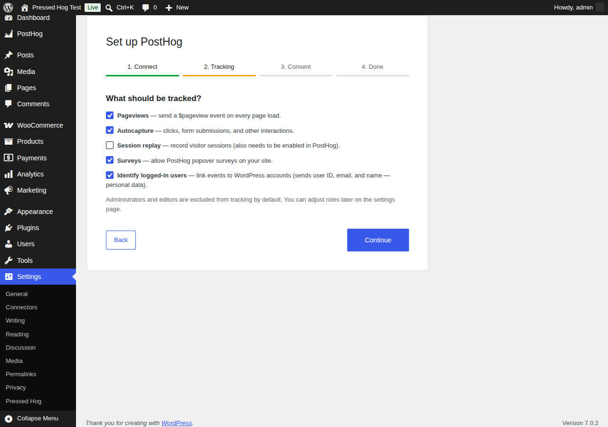
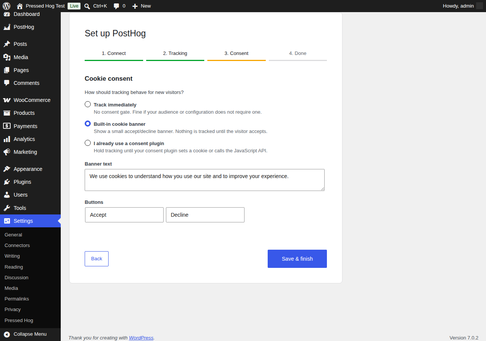
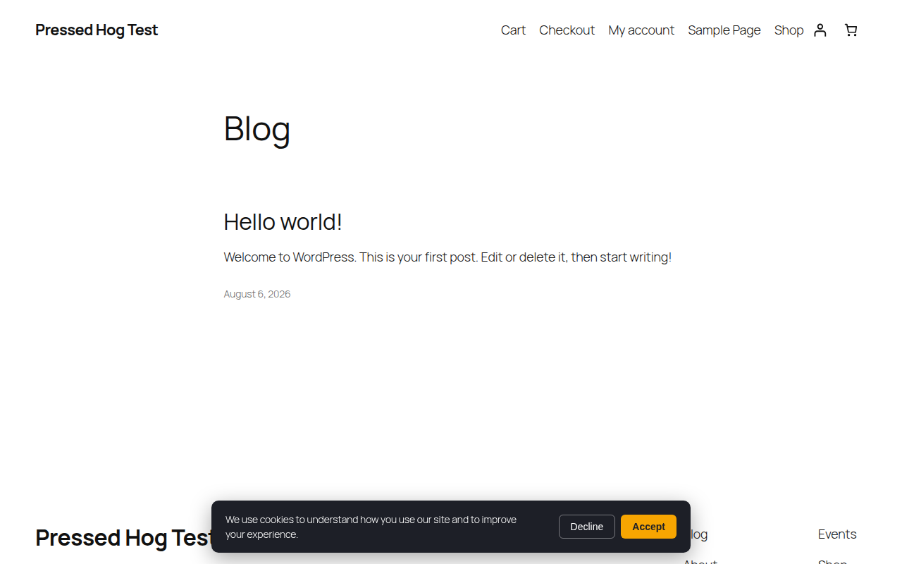
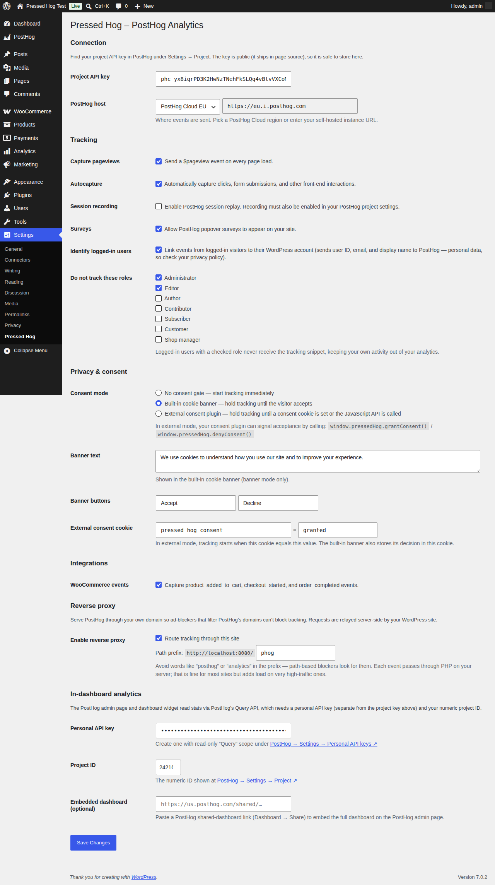

# Pressed Hog walkthrough

This guide takes you from a zip file to seeing real events in PostHog, then through each optional feature. Every screenshot is from a live install.

## Before you start

You'll need:

- A WordPress site (6.0+, PHP 7.4+) where you can install plugins.
- A PostHog project. If you don't have one, sign up at [posthog.com](https://posthog.com) (US or EU cloud — the plugin supports both, plus self-hosted).
- Your project's **API key** — in PostHog, open **Settings → Project**. It starts with `phc_` and is safe to expose publicly.

## 1. Install and activate

1. Download this repository as a zip (**Code → Download ZIP** on GitHub).
2. In wp-admin, go to **Plugins → Add New → Upload Plugin**, choose the zip, and install. (Or unzip it into `wp-content/plugins/pressed-hog` yourself.)
3. Click **Activate**.

On activation you're redirected straight into the setup wizard. (If you skip it, an admin notice links back to it, and there's a "Setup wizard" link under the plugin on the Plugins screen.)

## 2. The setup wizard

### Step 1 — Connect


Pick your **region** (PostHog Cloud US, Cloud EU, or Self-hosted — which reveals an instance URL field), paste your **project API key**, and click **Validate & continue**. The plugin checks the key against your PostHog host *from your server*, so a typo'd key or wrong region fails right here instead of silently sending events nowhere.

If your server can't reach PostHog (a firewall, for instance), you'll see a warning with a *continue anyway* option — browser-side tracking may still work in that case.

### Step 2 — Tracking



Choose what to capture:

- **Pageviews** — a `$pageview` event on every page load.
- **Autocapture** — clicks, form submissions, and other interactions.
- **Session replay** — session recordings (must *also* be enabled in your PostHog project settings).
- **Surveys** — allow PostHog popover surveys on your site.
- **Identify logged-in users** — links events to WordPress accounts. This sends the user ID, email, and display name to PostHog — personal data, so check your privacy policy before enabling.

Administrators and editors are excluded from tracking by default; you can change which roles are excluded later in settings.

### Step 3 — Consent



Three options:

- **Track immediately** — no consent gate.
- **Built-in cookie banner** — visitors see an accept/decline banner and *nothing is captured until they accept*. You can customize the text and button labels.
- **I already use a consent plugin** — tracking stays off until your consent plugin sets a cookie you configure, or calls the JavaScript API (see [Consent modes](#5-consent-modes)).

Click **Save & finish**.

### Step 4 — Done

Click **Send a test event**. The plugin authenticates your key and sends a `pressed_hog_test_event` from your server. When it succeeds, open your PostHog project's **Activity** feed — the event should be there within a minute. That confirms the whole path works.

## 3. See your first real events

Open your site in a private/incognito window (so you're not logged in as an excluded admin) and click around. In PostHog's Activity feed you should see `$pageview` events — and `$autocapture` events if enabled. If you enabled the consent banner, accept it first:



**Not seeing events?**

- Logged in as an admin? Admins are excluded by default — use a private window.
- Consent banner enabled? Events only flow after clicking Accept.
- Ad-blocker running? Enable the [reverse proxy](#7-reverse-proxy) below.
- Automated browser / headless testing? posthog-js ignores bots and automated browsers by design — test with a real browser.

## 4. The settings page

Everything lives at **Settings → Pressed Hog**:



Beyond what the wizard covers, this adds: which roles to exclude, the reverse proxy, and the in-dashboard analytics connection.

## 5. Consent modes

The built-in banner stores the visitor's decision in a cookie (`pressed_hog_consent` by default, 180 days). Declining opts the visitor out via posthog-js's own opt-out mechanism.

With an external consent plugin, configure the cookie name/value the plugin sets on acceptance in the "External consent cookie" setting — or wire your consent plugin's callbacks to:

```js
window.pressedHog.grantConsent();  // start tracking (and identify, if enabled)
window.pressedHog.denyConsent();   // opt out
```

In both gated modes PostHog initializes opted-out, so nothing is captured before consent — including the identify call, which is deferred until after acceptance.

## 6. WooCommerce events

If WooCommerce is active, enable **WooCommerce events** in settings (or just tick it in the wizard's Tracking step — the option appears under Integrations in settings). You'll get:

| Event | When | Properties |
| --- | --- | --- |
| `product_added_to_cart` | Add-to-cart on shop/product pages (classic *and* block themes) | `product_id`, `quantity` |
| `checkout_started` | Checkout page load | — |
| `order_completed` | Order confirmation (thank-you) page | `order_id`, `total`, `currency`, `item_count`, `items[]` |

`order_completed` fires once per order (a reload of the thank-you page won't double-count) and only for visitors holding the order's secret key — the same rule WooCommerce uses to show order details.

## 7. Reverse proxy

Ad-blockers commonly block PostHog's domains, which silently costs you a chunk of your data. The reverse proxy serves PostHog through *your own* domain instead:

1. Make sure pretty permalinks are on (**Settings → Permalinks**, anything except "Plain").
2. In **Settings → Pressed Hog → Reverse proxy**, tick **Route tracking through this site**.

The tracking script and all events now flow via `yoursite.com/phog/…` and your server relays them to PostHog, forwarding each visitor's IP so geolocation stays accurate. The path prefix is configurable — avoid words like "posthog" or "analytics" in it, since path-based blockers look for them.

**Trade-off:** every tracked event passes through PHP on your server. Fine for most sites; very high-traffic sites should prefer a CDN-level proxy (Cloudflare Workers etc.) instead.

## 8. Analytics inside wp-admin

The **PostHog** menu item in wp-admin shows your traffic without leaving WordPress — pageviews, unique visitors, deltas vs the previous period, a traffic chart, top pages, referrers, and devices, over the last 7/30/90 days — plus a summary widget on the WP Dashboard:


This reads PostHog's Query API, which needs two extra values (the page walks you through it with direct links if they're missing):

1. **Personal API key** — create one at PostHog → **Settings → Personal API keys**, with the read-only **Query** scope only. Paste it into Settings → Pressed Hog → In-dashboard analytics.
2. **Project ID** — the numeric ID shown at PostHog → **Settings → Project**.

The key is only ever used server-side and results are cached for 5 minutes.

Optionally, paste a PostHog **shared dashboard** link (Dashboard → Share in PostHog) into the "Embedded dashboard" setting to embed the full dashboard at the bottom of the page.

## 9. Feature flags in content and code

Gate any content by a PostHog feature flag with the shortcode:

```
[posthog_flag key="new-pricing"]
This paragraph only appears for visitors with the flag enabled.
[/posthog_flag]

[posthog_flag key="cta-experiment" variant="variant-b"]
Shown only to the "variant-b" group of the experiment.
[/posthog_flag]
```

Or in theme/plugin PHP:

```php
if ( pressed_hog_is_feature_enabled( 'new-pricing' ) ) {
    get_template_part( 'partials/new-pricing-table' );
}

$variant = pressed_hog_get_feature_flag( 'cta-experiment' ); // false, true, or "variant-b"
```

Flags are evaluated server-side against PostHog's `/decide` endpoint with a 60-second cache. Logged-in visitors are evaluated by their WordPress user ID (matching the identify option); anonymous visitors by their posthog-js cookie. A brand-new visitor with no cookie yet evaluates flags as off.

## 10. Troubleshooting

| Symptom | Likely cause / fix |
| --- | --- |
| "That key was rejected by this host" in the wizard | Wrong region (US vs EU) or a typo in the key. |
| Events missing from some visitors | Ad-blockers — enable the reverse proxy. |
| Proxy URLs return 404 | Pretty permalinks are off, or rewrite rules are stale — re-save **Settings → Permalinks**. |
| No events while testing yourself | You're logged in with an excluded role; use a private window. |
| Analytics page shows an error | Personal API key lacks Query scope, or the project ID is wrong. |
| `order_completed` missing | The visitor reached the thank-you page without the order key, or the event already fired for that order. |
| Duplicated/missing data after changing settings | Flag and query caches last 60s / 5min — wait a moment. |

## Uninstalling

Deactivating stops all tracking. Deleting the plugin through the Plugins screen also removes its options, cached data, and rewrite rules. Data already in PostHog is unaffected.
